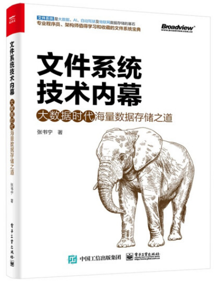

# 简介（Introduction）

在本人拙著《文件系统技术内幕》中，我们对文件系统的知识进行了深入的分析。同时，我们结合Linux内核的源代码进行了比较详细解释。虽然作者以为已经很详细的介绍了相关内容，但是有些同学还是觉得跟实际还有些差距，希望能够实战一下。于是本人决定从零实现一个文件系统，完全从零实现，不依赖任何已有代码。

 

无论是Windows的文件系统还是Linux的文件系统，都是在内核态实现的。如果我们基于内核来开发这个文件系统门槛会高很多。本质上来说，文件系统并不一定非得在内核态，比如作者所在公司Unity产品的文件系统就是用户态的文件系统。为了降低门槛，让大家能够快速，而不痛苦的学习文件系统的相关技术，作者决定基于用户态来开发这个文件系统。

虽然文件系统本身可以运行在用户态，也可以通过API来访问文件系统。但这种方式不够直观。最直观的方式还是像Ext4等文件系统那样展现一个树型层级目录结构。但是对于用户态的程序，如何在Linux操作系统中看到文件系统的层级目录结构呢？

作者想到两种方法，一种是基于NFS网络文件系统，可以实现一个服务端文件系统。这样在服务端的文件系统功能可以客户端可以呈现树型层级目录结构。另外一种是基于FUSE实现，FUSE是一个用户态文件系统系统框架，可以实现文件操作的转发，将操作从内核态转发到用户态。综合而言，前者需要了解网络文件系统的协议，无形中又增加了学习的门槛。最后，作者决定采用FUSE来开发我们的文件系统。

接下来我们简单介绍一下FUSE。FUSE实现了一个在用户态开发文件系统的框架，有了这个框架，我们可以在用户态开发文件系统的逻辑，而不用关心Linux内核的相关内容。从而大大降低了开发文件系统的门槛。

FUSE本身包含一个用户态的库和一个内核模块。内核态模块与VFS及其他文件系统的关系如图所示，可以理解FUSE为一个内核态的文件系统。内核态的文件系统，并不会将数据持久化，其功能是将文件系统访问请求转发到用户态。

用户态库提供了一套API，同时提供了一套接口规范，这套规范实际上是一组函数集合。基于FUSE开发文件系统就是实现FUSE定义的函数集合的某些或者全部函数。然后调用FUSE用户态库的API将实现的函数注册到内核模块中。在下图的示例中，ceph_fuse就是基于FUSE开发的一个用户态的文件系统，用于实现对CephFS的访问的。如果我们基于FUSE开发自己的文件系统，也是位于这个位置的。


前文已述，内核态的模块基于VFS实现了一个文件系统，可以与Ext4、NFS或者CephFS主机端的文件系统对比理解。但不同的是，当有用户请求达到该文件系统时，该文件系统不是访问磁盘或者是通过网络发送请求，而是调用用户态注册的回调函数。

接下来我们回到正题，关于我们从零实现一个文件系统的相关内容。我们的目的是让大家学习文件系统的相关原理和技术，最终目的并不是为了实现一个文件系统。因此，我们本着从简单到复杂的顺序来介绍相关内容。从第一个实例开始，我们就会实现一个可以运行的文件系统，然后逐渐增加功能。这样，我们就可以各个击破每一个技术点，而且从一开始就能感受。为了实现上述目的，这里打算完成如下文章和实例，下面每一条可能对应多篇文章。

1. 一个不是文件系统的文件系统（*可以挂载的文件系统，能够在根目录中看到若干文件和子目录。但是这个文件系统不能创建文件和修改文件。）*
2. 基于内存的文件系统  （*可以创建删除文件，但是数据不可以持久化，重启后数据会丢失。通过该实例了解FUSE主要API的用法*）
3. 第一个基于硬盘的文件系统（*通过本实例介绍文件系统如何管理硬盘空间*）
4. 可以创建子目录的文件系统（*通过本实例介绍目录数据的管理方法，之后可以具备树形结构的目录树了*）
5. 创建不同大小文件的文件系统（*介绍常见文件数据的管理方法，如间接块，Extent，链接等*）
6. 读写缓存，如何通过缓存提高文件系统的性能（*介绍缓存的实现及对性能的影响*）
7. 文件的属性与扩展属性
8. 文件的访问权限
9. 文件锁的原理与实现
10. 文件系统的日志与事务
11. 文件系统的配额管理
12. 文件的快照技术
13. ...

最后，需要说明的是开发环境的搭建。本文对应的实例除了依赖FUSE3以外不依赖其他第三方库。所有的代码都可以在Ubuntu 20.04上编译通过，当然在更高版本的Ubuntu环境估计也能编译通过，但作者目前没有测试验证。如下是需要安装的软件。

```
sudo apt -y install build-essential
sudo apt -y install cmake
sudo apt -y install fuse3
```
